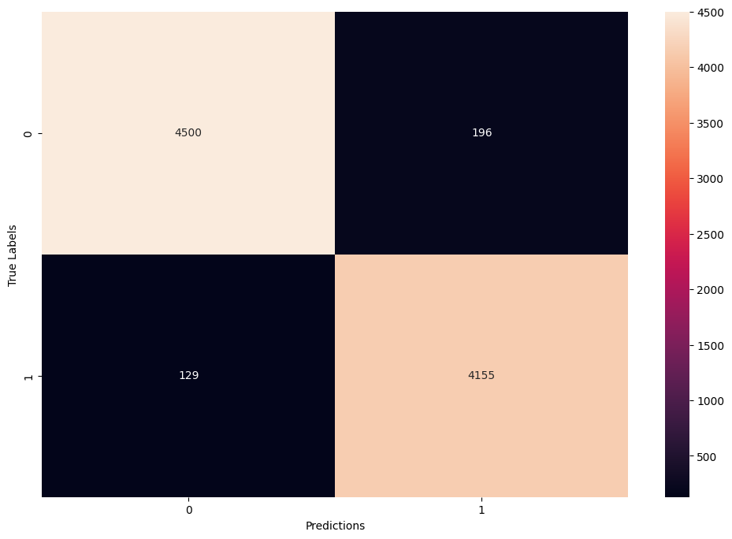

# Fake News Detection 

## Description 

This Fake News Detection system was built in the context of deepening my understanding and practice of NLP Pipeline. The *word2vec-google-news-300* pre-trained model from Gensim library was used for word and sentence embeddings. This pre-trained model was trained on approximately 100 billion words and contains around 300 million vectors. 

## Data

The data from Kaggle was used. It consisted in two separated csv files; one for real news and the other one for fake news. 

## Requirements 

Pytho 3.8 or higher
Gensim 
Sklearn
Pandas
Numpy
Spacy

If you wish to use this script to train a new model, beware you'll need to download the *en_core_web_lg* vocabulary from Spacy (780MB) as well as the the *word2vec-google-news-300* pretrained model (~1660MB). 

`python3 -m spacy download en_core_web_sm`

## Model

Ensemble learning was favoured for this project. More specifically, a *Gradient Boosting Classifier* from the popular sklearn library. By using a collection of "weaker" models and learning iteratively from each of them, the *Gradient Boosting Classifier* allows for stronger predictions. 

## Usage

This project doesn't include any user interface, it is notheless easily used from your usual CLI. 

To train your own dataset, you'll need to use the `prepare_dataset` with data properly divided in two csv files; one for real data, one for fake data. You can also use [Kaggle Fake News Dataset](https://www.kaggle.com/competitions/fake-news/data).  

## Results

Based on the unseen test data, the classification report returned good results:

|            |  precision |   recall | f1-score |  support |
|-------------------------|----------|----------|----------|
|          0 |     0.97   |   0.96   |   0.97   |   4696   |
|          1 |     0.95   |   0.97   |   0.96   |   4284   |
|   accuracy |            |          |   0.96   |   8980   |
|  macro avg |     0.96   |   0.96   |   0.96   |   8980   |
|weighted avg|     0.96   |   0.96   |   0.96   |   8980   |
|------------|------------|----------|----------|----------|

Confusion Matrix:

